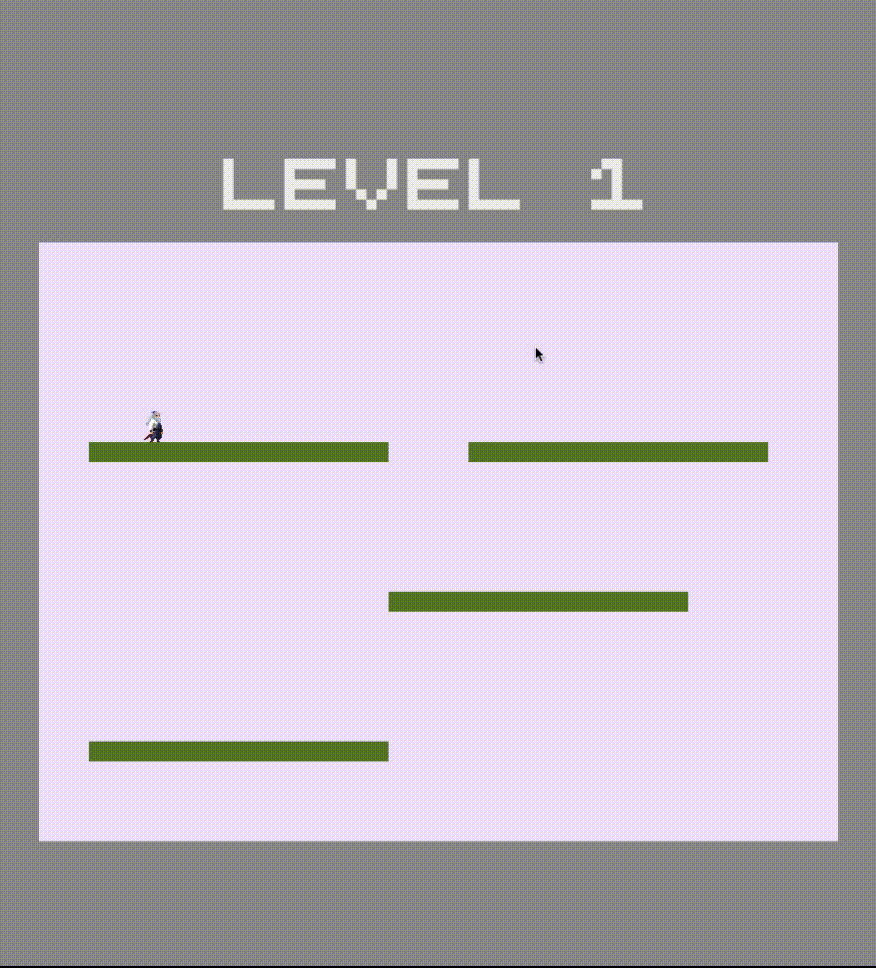

# Player First

This is the result of some fun time spent to create a simple character sprite with some basic animations.
No engines are used, just plain HTML, CSS and TypeScript.

Vite has been adopted for quick boilerplate.

I am pretty sure that this is not the best way to do it. Sorry, game devs.

## Usage

```bash
npm install
npm run dev
```

## Demo
[]()

